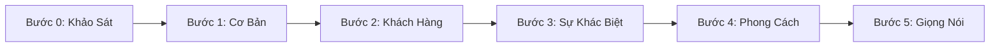

# Thiết Lập DNA Thương Hiệu (Brand Onboarding) 🧬

Chào anh chị chủ quán! Đây là **bước quan trọng số một** khi bắt đầu sử dụng **FnB Ăn Liền**. 

Nếu ví việc làm marketing cho quán giống như xây một ngôi nhà, thì **DNA Thương Hiệu** chính là phần móng. Nếu móng không chắc chắn (hoặc khai báo sơ sài), AI sẽ viết bài theo kiểu chung chung, thậm chí bịa ra các thông tin không có thật (ảo giác). Ngược lại, khi DNA được điền chi tiết, mọi nội dung viết ra sẽ mang đậm cá tính, giọng điệu đặc trưng riêng của quán.

---

## 📺 Video Hướng Dẫn Thao Tác
::: details 🎬 Nhấn vào đây để xem video hướng dẫn từng bước
*(Video hướng dẫn chi tiết các bước click chuột trên màn hình sẽ được cập nhật tại đây)*
:::

---

## Các Bước Thực Hiện Từ A-Z

Khi vừa đăng nhập lần đầu tiên, hệ thống sẽ tự động dẫn dắt anh chị qua **Khảo sát cá nhân hoá (Bước 0)** và **Brand Onboarding 5 Bước**. Anh chị có thể truy cập lại bất cứ lúc nào qua menu **DNA Thương Hiệu** trên thanh bên.

### 📍 Bước 0: Khảo Sát Cá Nhân Hoá
AI sẽ hỏi 3 câu hỏi rất nhanh để định hình cách tư vấn cho anh chị:
1. **Vai trò của anh chị:** Chủ quán vận hành, quản lý được giao phụ trách, hay người đang chuẩn bị mở quán?
2. **Khu vực của quán:** Phân loại theo tỉnh/thành phố để gợi ý chiến dịch local.
3. **Mức độ quen thuộc với AI:** Mới tinh hay đã từng dùng các chat bot khác.

---

### 📍 Bước 1: Thông Tin Cơ Bản
Anh chị nhập các thông số vật lý của quán:
* **Tên quán:** Nhập chính xác tên hiển thị trên biển hiệu (Ví dụ: *Cà Phê Muối Chú Long*, *Tiệm Trà Sen Đá*).
* **Mô hình kinh doanh:** Chọn loại hình chính xác (Cà phê specialty, Trà sữa, Tiệm bánh, Quán nhậu BBQ, Cơm văn phòng...).
* **Địa chỉ:** Điền rõ số nhà, tên đường, quận/huyện để AI phân tích hành vi người dùng tại địa phương đó khi lên bài.

---

### 📍 Bước 2: Khách Hàng Mục Tiêu (Target Audience)
Hãy mô tả chi tiết nhất có thể chân dung những người đem lại doanh thu cho quán.
* **Sai lầm nên tránh:** Điền chung chung kiểu *"Tất cả mọi người yêu thích đồ uống"*.
* **Cách điền đúng chuẩn F&B:** Chia rõ nhóm đối tượng chính, độ tuổi và nhu cầu.

> 💡 **Ví dụ thực tế cho quán Cà phê văn phòng:**
> *"Nhân viên văn phòng, công sở quanh khu vực phố Duy Tân (Cầu Giấy), độ tuổi 22 - 35. Họ cần cà phê tỉnh táo vào buổi sáng trước giờ làm (7h30 - 9h), có nhu cầu giao hàng tận bàn làm việc theo nhóm 3-5 người, thanh toán nhanh gọn bằng chuyển khoản."*

---

### 📍 Bước 3: Điểm Khác Biệt (USP - Unique Selling Proposition)
Đây là lý do khách hàng chọn quán của anh chị thay vì quán đối diện. Hãy khai báo những điểm chạm thực tế nhất.
* **Gợi ý các khía cạnh khác biệt dễ điền:**
  * *Chất lượng món:* Hạt cà phê mộc rang máy tại quán, trân châu tự làm thủ công, dùng sữa tươi thanh trùng thay vì sữa bột.
  * *Không gian:* Sân vườn rộng nhiều cây xanh, bàn làm việc có ổ cắm riêng, view ngắm hoàng hôn cực đẹp.
  * *Dịch vụ:* Nhân viên nhớ tên khách quen, chỗ đỗ xe ô tô miễn phí rộng rãi.

---

### 📍 Bước 4: Lựa chọn Phong Cách Thị Giác (Visual Concept)
FnB Ăn Liền cung cấp **8 bộ Concept thiết kế tiêu chuẩn** được đúc kết từ hàng ngàn quán thành công tại Việt Nam. Anh chị hãy chọn phong cách phù hợp nhất với quán của mình:

| Tên Concept | Đặc điểm thiết kế phù hợp |
| :--- | :--- |
| **Minimal Clean** | Phong cách tối giản kiểu Hàn Quốc/Nhật Bản, tone sáng, thanh lịch. |
| **Tropical Fresh** | Nhiều cây xanh, tươi mát, phù hợp với các quán nước dừa, nước ép sinh tố. |
| **Classic Vintage** | Gỗ trầm, hoài cổ, ấm cúng, phù hợp quán cà phê xưa hoặc trà đạo. |
| **Urban Modern** | Hiện đại, phá cách, tone xám/đen của xi măng và kim loại, hợp phong cách đường phố. |
| **Neo-Asian** | Sự giao thoa Á Đông hiện đại, tone màu đỏ/ấm của lồng đèn, hợp quán dimsum, trà sữa Trung Hoa. |
| **Cozy Warm** | Tone vàng ấm, gỗ sáng, tạo cảm giác thư giãn như ở nhà, hợp quán gia đình. |
| **Luxury Dark** | Tone đen sang trọng, ánh đèn huyền ảo, hợp quán specialty chất lượng cao hoặc pub/bar nhẹ. |
| **Playful Pop** | Màu sắc sặc sỡ năng động (hồng, vàng chanh...), hợp quán kem hoặc trà sữa hướng tới học sinh. |

---

### 📍 Bước 5: Giọng Nói Thương Hiệu (Brand Voice & Archetype)
Hệ thống sử dụng khung tâm lý thương hiệu Aaker để định hình cách AI xưng hô và viết bài:
1. **Sincere (Chân thành - Ấm áp):** Xưng hô *"Quán/Mình"* gọi khách là *"Bạn/Nhà mình"*. Thích kể chuyện mộc mạc về hạt cà phê, về góc bếp.
2. **Excitement (Trendy - Sôi nổi):** Xưng hô *"Quán tụi mình/Team..."* gọi khách là *"Các cạ cứng/Chiến thần"*. Bắt trend cực nhanh, viết bài hài hước.
3. **Competence (Chuyên nghiệp - Đáng tin):** Xưng hô *"Chúng tôi/Quán"* gọi khách là *"Quý khách"*. Viết bài chuẩn mực, nhấn mạnh vào chứng nhận vệ sinh, nguồn gốc hạt hạt, quy trình pha chế.
4. **Sophistication (Tinh tế - Sang trọng):** Văn phong tao nhã, nhẹ nhàng, thiên về cảm xúc và sự trải nghiệm giác quan.
5. **Ruggedness (Mộc mạc - Bụi bặm):** Cách xưng hô phóng khoáng, thích hợp cho các quán cà phê võng, quán nhậu vỉa hè.

---

## 💡 Mẹo nhỏ để điền DNA siêu chuẩn
Nếu anh chị bối rối không biết viết gì ở các ô nhập văn bản, hãy áp dụng công thức **Prompt (gợi ý) hỏi Matcha AI** sau để nó giúp anh chị định hình:

> **Prompt mẫu hỏi Matcha AI:**
> *"Mình sắp mở một quán trà sữa phân khúc bình dân hướng tới học sinh cấp 3 gần trường THPT Chu Văn An. Quán có món signature là trà sữa nướng trân châu hoàng kim tự làm, không gian có góc check-in màu hồng bánh bèo. Hãy gợi ý giúp mình phần điền 'Khách hàng mục tiêu' và 'Điểm khác biệt' để mình copy vào phần thiết lập DNA nhé."*

Sau khi lưu lại, hệ thống sẽ kích hoạt toàn bộ công cụ viết bài và thiết kế ảnh dựa trên DNA vừa khai báo!

---
*Xem thêm bài tiếp theo:* [Chỉnh sửa cấu hình & Theo dõi chỉ số DNA Score](./chinh-sua)